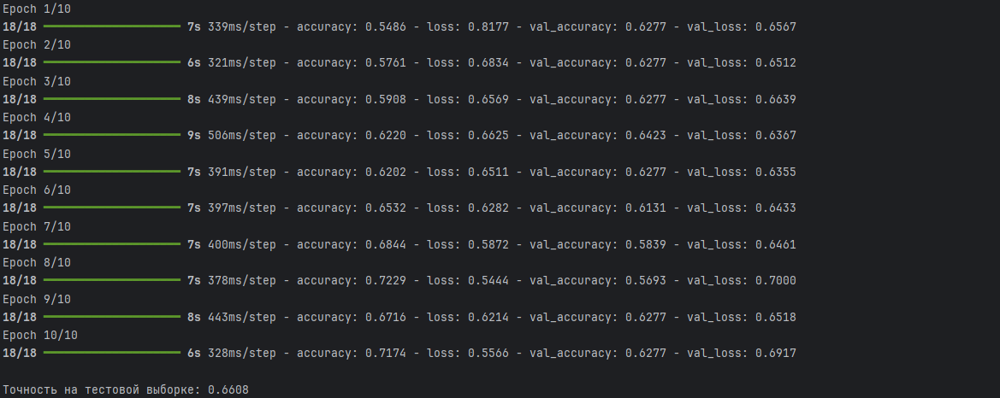

# CNN или Сверточные нейроные сети

---

Сеть находит свертки, которые максимизируют информацию об изображении.

На первом уровне сеть извлекает самые базовые: границы, штрики, отрезки, контрасты. Повыше - уже более устойчивые комбинацииэлементов
первого уровня, и так далее вверх по цепочке.

## Принцип работы CNN

---

Фильтр скользит по входному изображению, вычисляя скалярное произведение между своими весами и соответствующими участками изображения. Каждый фильтр ищет определённую особенность: одни — горизонтальные линии, другие — углы или части объектов. Результат работы фильтра на каждом участке изображения — карта признаков.


## Архитектура CNN

---

* Сверточный слой — выделяет локальные особенности входного изображения.
* Слой подвыборки (пулинг) — уменьшает размерность данных и помогает оставить только самые значимые признаки.
* Полносвязный слой — строит итоговую модель на основе найденных признаков, отвечает за классификацию или принятие решения.


## Dataset и работа с ним

Dataset был скачен на сайте <b>kagglehub: face-mask-detection

Для обработки данных было создано две функции:

1) parse_xml_annotation - распарсили .xml файлы - разбили по классам 
2) load_dataset - загруэаем наши изображения, с помощью распаршенной аннотации получаем признаки. Преобразуем наши изображение следующим образом: 
PIL Image → numpy array shape: (height, width, channels)


Разделим нашу выборку в соотношении 80/20
```
train_images, test_images, train_labels, test_labels = train_test_split(
    images, labels, test_size=0.2, random_state=42
)
```

Нормализуем значения. Почему делим на 255? - Чтобы привести к значениям 0 или 1.
Это стандартизирует данные и проще для градиентного спуска.
```
train_images = train_images.astype('float32') / 255.0
test_images = test_images.astype('float32') / 255.0
```

## Подготовка и настройка модели

Построем нашу модель
```
model = keras.Sequential([ # Создаем последовательную модель

    # Создается 32 фильтра размером 3на3на3, каждый филтр скользит по изображению
    # Вычисляется скалярное произведение фильтра и участка изображения
    # В результате получим карту признаков 
    layers.Conv2D(32, (3, 3), activation='relu', input_shape=(150, 150, 3)), 
    
    #Берется окно 2на2, выбирается максимальное значение - по итогу получим объединение и уменьшанную размерность
    layers.MaxPooling2D((2, 2)),

    layers.Conv2D(64, (3, 3), activation='relu'),
    layers.MaxPooling2D((2, 2)),

    layers.Conv2D(128, (3, 3), activation='relu'),
    layers.MaxPooling2D((2, 2)),

    layers.Flatten(), # Преобразует наш 3d тензер в единичный вектор
    
    #Полносвязные слои 
    layers.Dense(128, activation='relu'), 
    layers.Dropout(0.5), # Отключение 50% нейронов

    layers.Dense(1, activation='sigmoid')
])
```

## Обучение
```
model.compile(
    optimizer='adam', # автоматически адаптирует скорость обучения для каждого параметра
    loss='binary_crossentropy', # измеряет разницу между предсказанными вероятностями и фактическими метками в задачах бинарной классификации
    metrics=['accuracy'] # долю правильных предсказаний модели относительно общего числа предсказаний
)

model.fit(
    train_images, train_labels,
    epochs=10,  # Количество полных проходов по данным
    batch_size=32, # Количество образцов за одну итерацию
    validation_split=0.2, 
    verbose=1
```

## Результаты 



